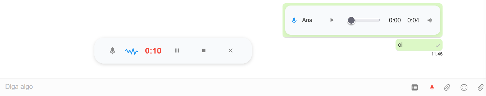

# 3CX Audio Recorder Extension

Esta extensão permite a integração com o chat do 3CX para gravação de áudio.

## Estrutura do Projeto

O projeto está organizado em duas pastas principais:

- `firefox-extension/`: Contém a versão da extensão para o Mozilla Firefox
- `chrome-extension/`: Contém a versão da extensão para o Google Chrome

## Instalação

### Firefox
1. Abra o Firefox
2. Digite `about:debugging` na barra de endereços
3. Clique em "Este Firefox"
4. Clique em "Carregar extensão temporária"
5. Navegue até a pasta `firefox-extension` e selecione o arquivo `manifest.json`

### Chrome
1. Abra o Chrome
2. Digite `chrome://extensions` na barra de endereços
3. Ative o "Modo do desenvolvedor" no canto superior direito
4. Clique em "Carregar sem compactação"
5. Navegue até a pasta `chrome-extension` e selecione-a

## Funcionalidades

- Integração com o chat do 3CX
- Gravação de áudio
- Interface amigável

## Requisitos

- Firefox 58.0 ou superior (para a versão Firefox)
- Chrome 88.0 ou superior (para a versão Chrome)

## Licença

Este projeto está licenciado sob a licença MIT - veja o arquivo [LICENSE](LICENSE) para mais detalhes.

## ✨ Features

- **Integrated audio recording:** Record voice messages directly in the 3CX chat with a modern floating window and intuitive controls (pause, resume, cancel, send).
- **Preview before sending:** Listen to your recorded audio before sending, with a custom player and action buttons.
- **Custom audio player:** All sent and received audios in the chat are displayed with a beautiful, responsive, and consistent player, including:
  - Microphone icon
  - Sender's name (first name only)
  - Custom progress bar
  - Large, accessible play/pause button
  - Elapsed and total time
  - Volume icon
- **Supports .webm, .ogg, and .m4a audio files**
- **Responsive design, fully integrated with 3CX**
- **Does not alter the original chat layout:** The message input and buttons always remain visible.

## 🖼️ Preview

## 🤝 Contributing

Contributions are very welcome!  
Open an issue or submit a pull request to suggest improvements, report bugs, or add new features.

## 🙏 Acknowledgements

- [3CX](https://www.3cx.com/) for the great chat system.
- [Mozilla WebExtensions](https://developer.mozilla.org/en-US/docs/Mozilla/Add-ons/WebExtensions) for the modern extension framework.

---

**Developed with ❤️ by M4NT / [@yan.mantovani](https://www.instagram.com/yan.mantovani/)**
