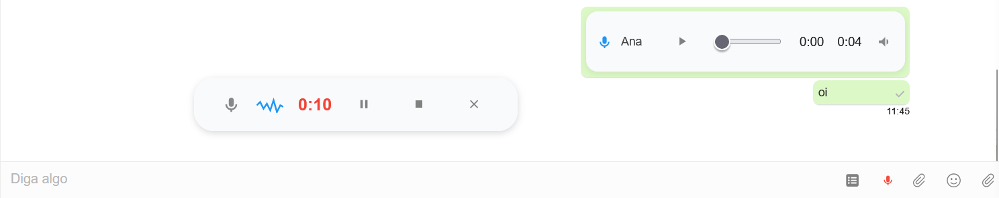

# 3CX Audio Recorder Extension

Esta extensão permite a integração com o chat do 3CX para gravação de áudio.

## Estrutura do Projeto

O projeto está organizado em uma pasta principal:

- `firefox-extension/`: Contém a versão da extensão para o Mozilla Firefox

## Instalação

### Firefox
1. Abra o Firefox
2. Digite `about:debugging` na barra de endereços
3. Clique em "Este Firefox"
4. Clique em "Carregar extensão temporária"
5. Navegue até a pasta `firefox-extension` e selecione o arquivo `manifest.json`

## Funcionalidades

- **Integração com o chat do 3CX**  
  A extensão injeta um botão de microfone diretamente na barra de envio do chat do 3CX, sem quebrar o layout original.

- **Janela flutuante de gravação**  
  Ao iniciar a gravação, uma barra flutuante é exibida com:
  - indicador visual de gravação (onda + tempo em vermelho);
  - botões redondos de **pausar/retomar**, **parar** e **cancelar**;
  - animações suaves de entrada e de “pulso” no botão de parar.

- **Atalho de teclado global (na aba do 3CX)**  
  - `Ctrl + Shift + R` (ou `Cmd + Shift + R` no macOS) para iniciar/parar a gravação, reutilizando o mesmo botão do chat.

- **Pré-visualização antes de enviar**  
  - Ao parar a gravação, é exibida uma barra de preview com player customizado (play/pause, barra de progresso, tempo decorrido/total, volume).
  - Botão verde de **enviar** e botão de **cancelar**, permitindo revisar o áudio antes de anexar.

- **Player customizado nas mensagens da conversa**  
  - Todo áudio (enviado ou recebido) aparece em uma bolha com:
    - ícone de microfone;
    - botão de play/pause redondo;
    - barra de progresso e tempos (decorrido/total);
    - ícone de volume;
    - **controle de velocidade** com botão circular `1x / 1.5x / 2x`.

- **Suporte a múltiplos formatos de áudio**  
  - `.webm`, `.ogg` e `.m4a` (dependendo do que o 3CX aceitar na conversa).

- **Design responsivo e respeitando o 3CX**  
  - A barra de chat original permanece funcional;
  - Campos de texto e botões padrão continuam visíveis e utilizáveis.

## Requisitos

- Firefox 58.0 ou superior

## Detalhes técnicos

- **Tecnologias usadas**
  - WebExtensions API (versão Firefox);
  - `content script` principal em `firefox-extension/content.js`;
  - APIs de mídia do navegador: `navigator.mediaDevices.getUserMedia` + `MediaRecorder`;
  - Manipulação de DOM para integrar com o layout do 3CX.

- **Fluxo de gravação**
  - O `content script` injeta o botão de microfone no container `#chat-form-controls` do 3CX.
  - Ao iniciar, é solicitado acesso ao microfone e criado um `MediaRecorder` que grava em `audio/webm`.
  - Ao parar a gravação:
    - os chunks são convertidos em `Blob` e depois em `File`;
    - o arquivo é anexado ao input de upload do 3CX via `DataTransfer`;
    - um evento `change` é disparado para simular o envio normal de arquivo.

- **Player nas mensagens**
  - Um `MutationObserver` monitora a árvore do chat para encontrar anexos de áudio (`file-message`, links `.webm/.ogg/.m4a`).
  - Esses anexos são substituídos por um componente de player customizado baseado em `<audio>`:
    - controla `currentTime`, `duration` e `playbackRate` (para o controle de velocidade);
    - mantém compatibilidade total com o fluxo de download padrão do 3CX (o link original ainda está disponível por baixo).

- **Atalhos e acessibilidade**
  - Listener global de teclado na aba do 3CX para `Ctrl/Cmd + Shift + R`;
  - Botões com `title`/tooltip descritivo e foco visível para navegação por teclado.

## Licença

Este projeto está licenciado sob a licença MIT - veja o arquivo [LICENSE](LICENSE) para mais detalhes.

## ✨ Features

- **Integrated audio recording:** Record voice messages directly in the 3CX chat with a modern floating window and intuitive controls (pause, resume, cancel, send).
- **Preview before sending:** Listen to your recorded audio before sending, with a custom player and action buttons.
- **Custom audio player:** All sent and received audios in the chat are displayed with a beautiful, responsive, and consistent player, including:
  - Microphone icon
  - Sender's name (first name only)
  - Custom progress bar
  - Large, accessible play/pause button
  - Elapsed and total time
  - Volume icon
- **Supports .webm, .ogg, and .m4a audio files**
- **Responsive design, fully integrated with 3CX**
- **Does not alter the original chat layout:** The message input and buttons always remain visible.

## 🖼️ Preview

## 🤝 Contributing

Contributions are very welcome!  
Open an issue or submit a pull request to suggest improvements, report bugs, or add new features.

## 🙏 Acknowledgements

- [3CX](https://www.3cx.com/) for the great chat system.
- [Mozilla WebExtensions](https://developer.mozilla.org/en-US/docs/Mozilla/Add-ons/WebExtensions) for the modern extension framework.

---

**Developed with ❤️ by M4NT / [@yan.mantovani](https://www.instagram.com/yan.mantovani/)**
